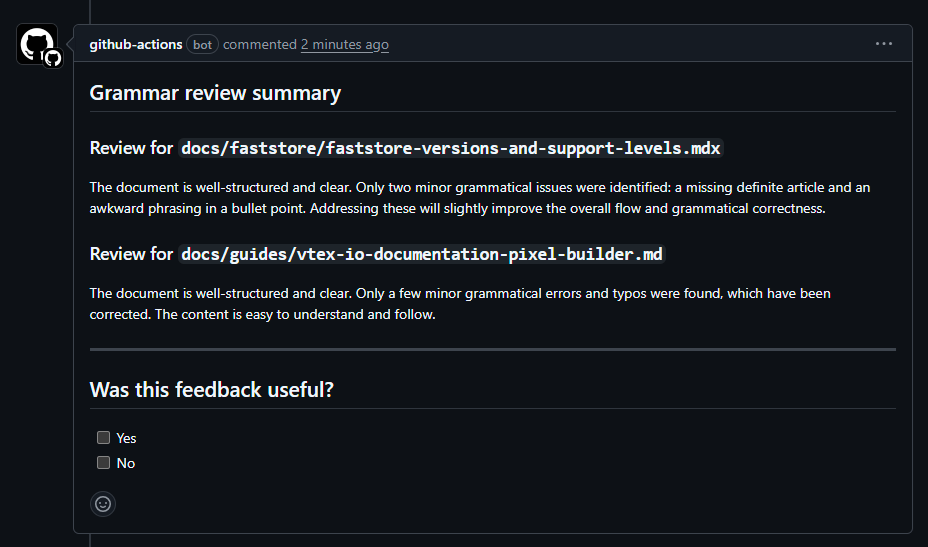
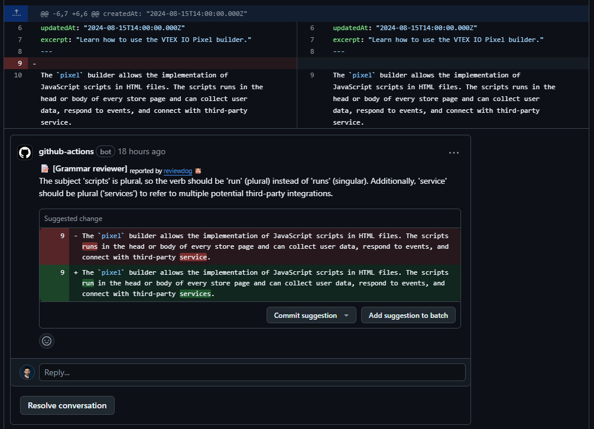
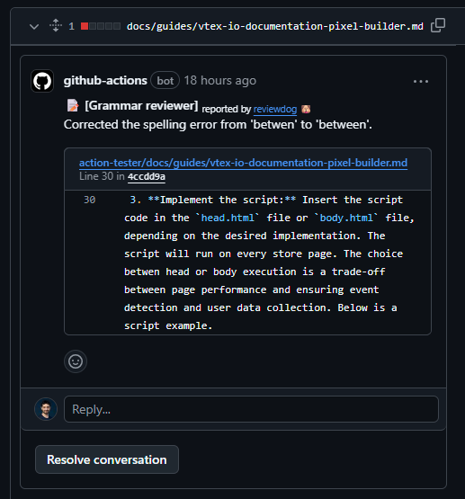
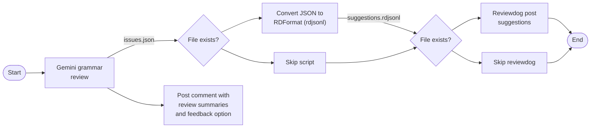

# AI Grammar Reviewer Action

A GitHub Action that integrates with Google Gemini AI to automatically make grammar reviews in Markdown files of pull requests (PRs).

## How it works

This action executes a series of steps to read the Markdown files, use Google Gemini AI to review them, save the review data in temporary files, and post the review in two forms: summary comment and inline suggestions.

### Summary comment

The summary comment is a single comment in the PR formatted in Markdown and HTML including a summary of the review for each file reviewed. It also has a feedback option, which is collected by another action.



### Inline suggestions

Inline suggestions appear in the file diffs, so they can be [easily applied](https://docs.github.com/en/pull-requests/collaborating-with-pull-requests/reviewing-changes-in-pull-requests/incorporating-feedback-in-your-pull-request). The action uses [reviewdog](https://github.com/reviewdog/reviewdog) to post suggestions. The action posts one suggestion per line where Gemini identifies an issue.



When issues occur outside the scope of the content changed in the PR (diff hunk), inline suggestions cannot be posted due to a [GitHub limitation](https://github.com/microsoft/vscode-pull-request-github/issues/172). Instead, reviewdog post them as comments for the file. The issue line is still indicated in the comment.



## Action usage

To use this action in your GitHub repository, follow these steps:

1. Get a [Gemini API key](https://ai.google.dev/gemini-api/docs/api-key) in [Google AI Studio](https://aistudio.google.com/app/apikey).
2. Add your key as a [secret to your repository](https://docs.github.com/en/codespaces/managing-codespaces-for-your-organization/managing-development-environment-secrets-for-your-repository-or-organization#adding-secrets-for-a-repository).
3. Create the workflow file for your repository in the `.github/workflows` folder. It will use the secret with the same name you chose in the repository configuration (e.g., `GEMINI_API_KEY`). Here is an example of workflow configuration:

    ```yml
      name: AI Grammar Reviewer

      on:
        pull_request:
          paths:
            - 'docs/**/*.md'
            - 'docs/**/*.mdx'
          types: [opened, synchronize]

      permissions:
        contents: read
        pull-requests: write

      jobs:
        grammar-review:
          runs-on: ubuntu-latest
          steps:
            - uses: actions/checkout@v4
            - uses: vtexdocs/ai-grammar-reviewer-action@v0
              with:
                gemini_api_key: ${{ secrets.GEMINI_API_KEY }}
                github_token: ${{ secrets.GITHUB_TOKEN }}
    ```

## Internal workings

The action runs from a Dockerfile that calls a shell script. This script has the following steps:

1. Execute a Python script for the Gemini grammar review (`grammar_reviewer.py`). It has these steps:
    1. Retrieve the content of the Markdown files.
    2. For each file, call the Gemini API with the grammar review prompt. The request uses a JSON schema parameter to format the response in a specific JSON format. This response includes:
        - A list of objects for each issue, whose field are the line number, the original content, the suggested correction, and an explanation for the correction.
        - A string with the summary of the file review.
    3. Write the lists of issues in a JSON file (`issues.json`), which will be used for the next python script to post the suggestions.
    4. Aggregate the review summaries and use the GitHub API to post them as a single comment along with the feedback option.
2. Verify if the `issues.json` file exists. If true, execute a Python script (`generate_rdjsonl.py`) to convert the issues JSON to a format that reviewdog accepts and creates another file (`suggestions.rdjsonl`). It uses [RDFormat with rdjsonl](https://github.com/reviewdog/reviewdog/tree/master/proto/rdf#rdjsonl).
3. Verify if the `suggestions.rdjsonl` file exists. If true, execute reviewdog to post suggestions.


